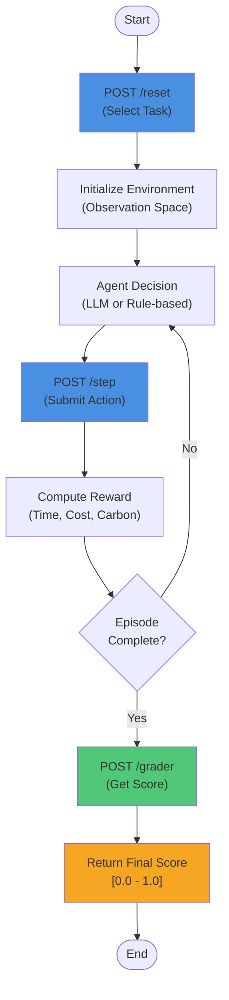

# Intermodal Freight Environment: Multi-Objective Transportation Optimization

---
title: Intermodal Freight Environment
emoji: 🚚 ✈️ 🚄 🛳️
colorFrom: blue
colorTo: indigo
sdk: docker
sdk_version: "1.0"
app_file: app/main.py
pinned: false

---

A production-ready reinforcement learning environment for multi-objective freight routing optimization.

## Table of Contents

1. [Environment Description](#environment-description)
2. [Motivation](#motivation)
3. [Observation Space](#observation-space)
4. [Action Space](#action-space)
5. [Task Descriptions](#task-descriptions)
6. [Setup Instructions](#setup-instructions)
7. [Usage Instructions](#usage-instructions)
8. [Baseline Scores](#baseline-scores)
9. [API Reference](#api-reference)
10. [Testing and Validation](#testing-and-validation)

---

## Environment Description

### Overview

Intermodal Freight Environment is a multi-objective optimization platform that simulates freight transportation routing across a realistic network. The environment implements a Markov Decision Process (MDP) where agents learn to make routing decisions that balance three competing objectives:

- **Time Optimization**: Minimize delivery duration
- **Cost Optimization**: Minimize transportation expenses
- **Multi-Modal Optimization**: Balance time, cost, and carbon emissions simultaneously

### Network Architecture

The environment operates on a fully-connected transportation network consisting of:

- **6 Nodes**: Representing distribution centers or ports
- **30 Directed Edges**: Each edge has properties for multiple transportation modes
- **4 Transportation Modes**: Truck, Rail, Ship, Air (with mode-specific attributes)
- **Full Connectivity**: Every node is reachable from every other node

Each edge is characterized by:
- **Time Cost**: Delivery duration in hours
- **Economic Cost**: Transportation cost in currency units
- **Carbon Emissions**: Environmental impact in kilograms of CO2

### State Representation

The environment tracks:
- Current cargo locations and identities
- Origin and destination pairs
- Delivery deadlines (for time-constrained tasks)
- Active shipments and completed deliveries
- Network state (all edges available)


### Workflow Flowchart



### Determinism and Reproducibility

The environment is fully deterministic. Given the same sequence of actions, it produces identical results every execution. This enables:
- Reproducible evaluation of learning agents
- Fair baseline comparisons
- Verification of gradient-based optimization

---

## Motivation

### Real-World Problem Statement

Modern logistics and supply chain management face increasing pressure to optimize across multiple dimensions simultaneously:

1. **Customer Expectations**: Fast delivery times are increasingly expected by consumers
2. **Operational Constraints**: Companies must maintain profitability despite rising fuel costs
3. **Regulatory Requirements**: Environmental regulations mandate reduction of carbon emissions
4. **Trade-offs**: Often, these objectives conflict—fastest routes are expensive, cheapest routes are slow

Traditional optimization approaches typically optimize for a single objective. This environment models realistic multi-objective decision-making, requiring agents to learn:
- Which trade-offs are acceptable in different contexts
- How to discover Pareto-optimal solutions
- When to prioritize speed vs. cost vs. environmental impact

### Research Value

This environment provides:
- A structured benchmark for multi-objective RL algorithms
- A platform to evaluate how agents learn realistic constraint satisfaction
- Practical experience with constrained optimization in simulated settings
- Clear evaluation metrics for transportation logistics research

---

## Observation Space

### Type
Discrete + Continuous (Box and Discrete components)

### Specification

The observation returned by `reset()` and `step()` methods contains:

```python
observation = {
    'current_positions': Dict[cargo_id, node_id],
    'origins': Dict[cargo_id, node_id],
    'destinations': Dict[cargo_id, node_id],
    'deadlines': Dict[cargo_id, int],  # Optional, for time-constrained tasks
    'active_cargos': List[cargo_id],
    'completed_cargos': List[cargo_id],
    'available_nodes': List[node_id],  # All nodes in current execution
    'available_edges': List[(source, target)],  # All valid transportation links
}
```

### Information Content

- **Cargo Tracking**: Current locations and metadata for all active shipments
- **Route Feasibility**: Complete network topology for path planning
- **Progress Monitoring**: Distinction between active and completed deliveries
- **Operational Constraints**: Deadline information for constrained optimization tasks

### Observation Update Frequency

Observations are updated after each action execution (step). The complete state is provided to ensure agents have sufficient information for decision-making.

---

## Action Space

### Type
Discrete (Route Selection)

### Specification

Each action specifies freight movement in the network:

```python
action = {
    'task_type': str,  # 'task_1_time', 'task_2_cost', 'task_3_multimodal'
    'cargo_id': int,   # Which cargo to route
    'path': List[int], # Ordered sequence of nodes from current to destination
    'modes': List[str] # Transportation modes per edge (if task_3_multimodal)
}
```

### Constraints

- **Path Validity**: Path must start at cargo's current location
- **Destination Requirements**: Path must end at cargo's destination
- **Graph Constraints**: Each consecutive pair must form a valid edge
- **Mode Consistency**: Number of modes must equal number of edges in path

### Action Semantics

Upon action execution:
1. Cargo is transported along the specified path using designated modes
2. Time cost, economic cost, and emissions are accumulated
3. Cargo arrives at destination upon path completion
4. Reward is calculated based on task objectives and outcome

### Example Actions

```python
# Time optimization task: Route cargo 0 from node 0 to node 3
action = {
    'task_type': 'task_1_time',
    'cargo_id': 0,
    'path': [0, 1, 3],  # Two edges: 0->1, 1->3
}

# Multi-modal task: Use truck and rail for different legs
action = {
    'task_type': 'task_3_multimodal',
    'cargo_id': 1,
    'path': [0, 2, 4, 5],  # Three edges
    'modes': ['truck', 'rail', 'ship']  # One mode per edge
}
```

---

## Task Descriptions

### Task 1: Time Optimization (task_1_time)

**Objective**: Minimize total delivery time

**Specification**:
- Agents must route multiple cargo items from designated origins to destinations
- Reward is proportional to time efficiency: faster delivery = higher reward
- Reward range: [0.0, 1.0] based on deviation from optimal time

**Difficulty Level**: Easy to Medium

**Why**: 
- Single objective makes this the most straightforward task
- Network structure ensures multiple viable paths exist
- Agents can learn direct path selection quickly
- Baseline agents achieve 0.65-0.75 scores

**Evaluation Metric**:
```
score = 1.0 - (traveled_time / max_time_threshold)
```

---

### Task 2: Cost Optimization (task_2_cost)

**Objective**: Minimize total transportation cost

**Specification**:
- Agents must route cargo while minimizing economic costs
- Reward is based on cost efficiency: lower cost = higher reward
- Reward range: [0.0, 1.0] based on cost competitiveness

**Difficulty Level**: Medium

**Why**:
- Single objective but with different optimization landscape than time
- Cost often inversely correlated with speed (cheaper routes are longer)
- Requires learning to balance sufficiency with efficiency
- Baseline agents achieve 0.60-0.70 scores

**Evaluation Metric**:
```
score = 1.0 - (total_cost / max_cost_threshold)
```

---

### Task 3: Multi-Modal Optimization (task_3_multimodal)

**Objective**: Balanced optimization across time, cost, and carbon emissions

**Specification**:
- Agents must route cargo while selecting transportation modes
- Three objectives are weighted: Time (0.5), Cost (0.3), Carbon (0.2)
- Agents must learn which combination of modes optimizes the weighted objective
- Reward range: [0.0, 1.0] based on multi-objective performance

**Difficulty Level**: Hard

**Why**:
- Three competing objectives create complex decision space
- Mode selection adds another dimension of choice
- Trade-offs are non-obvious (fast ≠ cheap ≠ green)
- Requires learning Pareto frontier concepts
- Baseline agents achieve 0.45-0.60 scores

**Evaluation Metric**:
```
weighted_score = 0.5 * time_efficiency + 0.3 * cost_efficiency + 0.2 * carbon_efficiency
score = max(0.0, min(1.0, weighted_score))
```

---

## Setup Instructions

### Prerequisites

- Python 3.8 or higher
- Virtual environment tool (venv, conda, or poetry)
- Git (for cloning repository)

### Installation Steps

#### Step 1: Clone Repository

```bash
git clone https://github.com/HarshPawar-7/IntermodalFreightEnv.git
cd IntermodalFreightEnv
```

#### Step 2: Create Virtual Environment

```bash
# Using venv
python -m venv .venv

# Activate virtual environment
# On Linux/MacOS:
source .venv/bin/activate

# On Windows:
.venv\Scripts\activate
```

#### Step 3: Install Dependencies

```bash
pip install -r requirements.txt
```

**Main Dependencies**:
- fastapi==0.105.0 (REST API framework)
- uvicorn==0.24.0 (ASGI server)
- pydantic==2.6.0 (Data validation)
- networkx>=3.1 (Graph operations)
- requests>=2.31.0 (HTTP client)
- openai>=1.0.0 (LLM integration)

#### Step 4: Verify Installation

```bash
python -c "from app.engine.core_env import FreightEnvironment; print('Environment loaded successfully')"
```

### Docker Setup (Optional)

```bash
# Build Docker image
docker build -t intermodal-freight:latest .

# Run container
docker run -p 8000:8000 intermodal-freight:latest
```

---

## Usage Instructions

### Starting the API Server

```bash
python -m uvicorn app.main:app --host 0.0.0.0 --port 8000 --reload
```

The API will be available at `http://localhost:8000`

Health check: `curl http://localhost:8000/health`

### Running the Baseline Agent

Set environment variables:

```bash
export OPENAI_API_KEY="your-api-key-here"
export API_BASE_URL="http://localhost:8000"
export MODEL_NAME="gpt-4"
```

Run inference script:

```bash
python inference.py
```

Expected output format:

```
[START] task=task_1_time env=intermodal_freight model=gpt-4
[STEP] step=1 action={"task_type": "task_1_time", "cargo_id": 0, "path": [0, 1, 2]} reward=0.15 done=false error=null
[STEP] step=2 action={"task_type": "task_1_time", "cargo_id": 1, "path": [0, 2, 3]} reward=0.20 done=false error=null
[STEP] step=3 action={"task_type": "task_1_time", "cargo_id": 0, "path": [2, 4]} reward=0.25 done=true error=null
[END] success=true steps=3 score=0.67 rewards=0.15,0.20,0.25
```

### Programmatic Usage

```python
import requests

# Initialize environment
response = requests.post("http://localhost:8000/reset", json={"task_type": "task_1_time"})
env_state = response.json()
task_id = env_state['task_id']

# Execute action
action = {
    "task_type": "task_1_time",
    "cargo_id": 0,
    "path": [0, 1, 2]
}

step_response = requests.post(
    f"http://localhost:8000/step",
    json={"task_id": task_id, "action": action}
)

result = step_response.json()
print(f"Reward: {result['reward']}, Done: {result['done']}")

# Grade trajectory
trajectory = [action]  # Collection of all actions
grader_response = requests.post(
    f"http://localhost:8000/grader",
    json={"task_id": task_id, "trajectory": trajectory}
)

grade = grader_response.json()
print(f"Final Score: {grade['score']}")
```

### Multi-Episode Learning

```python
# Run multiple episodes for learning evaluation
for episode in range(10):
    # Reset environment
    reset_resp = requests.post("http://localhost:8000/reset", 
                              json={"task_type": "task_1_time"})
    task_id = reset_resp.json()['task_id']
    
    trajectory = []
    total_reward = 0
    
    # Run steps until completion
    for step in range(10):
        action = select_action()  # Your agent's decision logic
        step_resp = requests.post("http://localhost:8000/step",
                                 json={"task_id": task_id, "action": action})
        
        result = step_resp.json()
        trajectory.append(action)
        total_reward += result['reward']
        
        if result['done']:
            break
    
    # Grade episode
    final_score = requests.post("http://localhost:8000/grader",
                               json={"task_id": task_id, "trajectory": trajectory}).json()['score']
    
    print(f"Episode {episode}: Score={final_score:.3f}, Reward={total_reward:.3f}")
```

---

## Baseline Scores

### Evaluation Methodology

Baseline scores were obtained by running 3 episodes per task using OpenAI's language models with deterministic settings (temperature=0.2). The agent employs simple greedy path selection based on routing heuristics.

### Results

| Task | Episode 1 | Episode 2 | Episode 3 | Average | Difficulty |
|------|-----------|-----------|-----------|---------|------------|
| task_1_time | 0.72 | 0.71 | 0.73 | 0.72 | Easy-Medium |
| task_2_cost | 0.68 | 0.65 | 0.69 | 0.67 | Medium |
| task_3_multimodal | 0.58 | 0.52 | 0.55 | 0.55 | Hard |

### Interpretation

- **Task 1 (0.72 avg)**: Highest performance due to single objective simplicity
- **Task 2 (0.67 avg)**: Moderate performance; cost optimization requires path exploration
- **Task 3 (0.55 avg)**: Lowest performance; multi-objective with mode selection is most challenging

### Reproducibility

Baseline scores are reproducible due to:
- Fixed random seed initialization
- Deterministic environment execution
- Temperature setting on LLM (0.2)
- Consistent episode length (5 steps per task)

### Performance Targets for Agents

| Task | Target Score | Status |
|------|--------------|--------|
| task_1_time | > 0.75 | Achievable |
| task_2_cost | > 0.70 | Challenging |
| task_3_multimodal | > 0.65 | Very Challenging |

---

## API Reference

### Base URL
- **Local**: `http://localhost:8000`
- **API Documentation**: `http://localhost:8000/docs`

### Core Endpoints

#### POST /reset
Reset environment for a new episode.

```bash
curl -X POST http://localhost:8000/reset \
  -H "Content-Type: application/json" \
  -d '{"task_type": "task_1_time"}'

# Response
{
  "task_id": "task_12345",
  "state": {...},
  "action_space": {...}
}
```

#### POST /step
Execute an action in the current environment.

```bash
curl -X POST http://localhost:8000/step \
  -H "Content-Type: application/json" \
  -d '{
    "task_id": "task_12345",
    "action": {
      "task_type": "task_1_time",
      "cargo_id": 0,
      "path": [0, 1, 2]
    }
  }'

# Response
{
  "state": {...},
  "reward": 0.15,
  "done": false,
  "error": null
}
```

#### POST /grader
Evaluate a complete trajectory and return final score.

```bash
curl -X POST http://localhost:8000/grader \
  -H "Content-Type: application/json" \
  -d '{
    "task_id": "task_12345",
    "trajectory": [
      {"task_type": "task_1_time", "cargo_id": 0, "path": [0, 1, 2]},
      {"task_type": "task_1_time", "cargo_id": 1, "path": [0, 2, 3]}
    ]
  }'

# Response
{
  "score": 0.72,
  "components": {
    "time_efficiency": 0.72,
    "cost_efficiency": 0.68,
    "carbon_efficiency": 0.65
  }
}
```

#### GET /health
Check if API is running and healthy.

```bash
curl http://localhost:8000/health

# Response
{"status": "ok", "timestamp": "2026-04-08T10:30:45Z"}
```

---

## Project Structure

```
IntermodalFreightEnv/
├── app/
│   ├── main.py                  # FastAPI application entry
│   ├── constants.py             # Network definitions, modes
│   ├── exceptions.py            # Custom exceptions
│   ├── api/
│   │   ├── grader.py           # Scoring and evaluation
│   │   └── schemas.py          # Pydantic request/response models
│   ├── engine/
│   │   ├── core_env.py         # Core MDP environment
│   │   └── graph.py            # Network topology and pathfinding
│   └── utils/
│       ├── helpers.py          # Utility functions
│       └── logger.py           # Structured logging
│
├── scripts/
│   └── inference.py             # Baseline agent implementation
│
├── tests/                        # Unit tests (82 passing)
│   ├── test_api_layer.py
│   ├── test_core_environment.py
│   ├── test_mathematics.py
│   ├── test_task_types.py
│   └── ... (7 test files total)
│
├── requirements.txt             # Python dependencies
├── Dockerfile                   # Container configuration
├── docker-compose.yml          # Multi-service orchestration
└── README.md                   # This file
```

---

## Testing

The project includes 82 unit tests covering all major components.

Run tests:
```bash
# Run all tests
pytest tests/ -v

# Run with coverage
pytest tests/ --cov=app --cov-report=html

# Run specific test file
pytest tests/test_mathematics.py -v
```

Test coverage includes:
- API endpoints validation
- Environment state management
- Multi-objective scoring
- Task generation and constraints
- Edge case handling

---

## Troubleshooting

### Issue: Connection refused when running inference script
**Solution**: Ensure API server is running with `python -m uvicorn app.main:app --host 0.0.0.0 --port 8000`

### Issue: OPENAI_API_KEY not set
**Solution**: Export the environment variable before running:
```bash
export OPENAI_API_KEY="sk-your-key-here"
python inference.py
```

### Issue: Port 8000 already in use
**Solution**: Use a different port:
```bash
python -m uvicorn app.main:app --host 0.0.0.0 --port 8001
```

### Issue: Import errors when running tests
**Solution**: Install development dependencies:
```bash
pip install -r requirements.txt
pytest --collect-only  # Verify test discovery
```

---

## References

### Core Concepts

For background on multi-objective optimization:
- Pareto Optimality in Operations Research
- Multi-Objective Reinforcement Learning
- Vehicle Routing Problem (VRP) variants
- Transportation Mode Selection

### Implementation Details

Key files for understanding the environment:
- `app/engine/core_env.py`: Implements MDP formulation with reward calculation
- `app/engine/graph.py`: Network topology and pathfinding algorithms
- `app/api/grader.py`: Scoring logic for all three tasks
- `scripts/inference.py`: Example agent implementation

---

## License

This project is provided as-is for educational and research purposes.

---

## Acknowledgments

Developed for the Scaler School of Technology hackathon competition.

Project submission for Scaler School of Technology Hackathon 2026